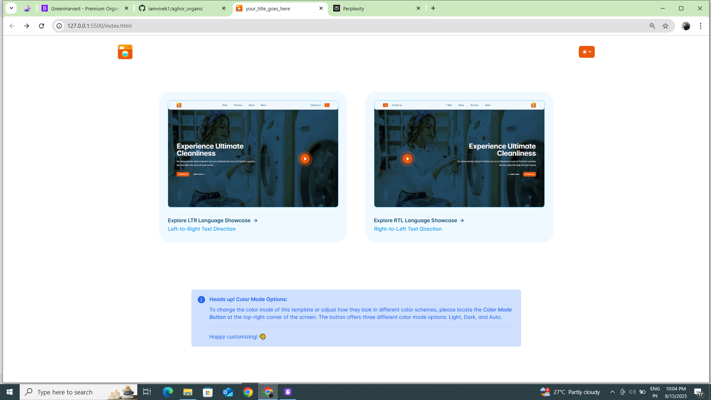

# ClothoCare - Premium Laundry Service Website

A modern, responsive website for ClothoCare, a premium laundry service company. Built with Bootstrap 5 and featuring a clean, professional design with both LTR and RTL language support.

## 🌟 Features

### 🎨 Design & UI
- **📱 Responsive Design** - Fully responsive across all devices
- **🎯 Modern UI/UX** - Clean and professional interface
- **🌙 Dark/Light Mode** - Theme switching capability
- **✨ Smooth Animations** - AOS (Animate On Scroll) effects

### 🌍 Multi-language Support
- **🔄 LTR/RTL Layouts** - Complete RTL support for Arabic/Hebrew
- **🌐 Internationalization** - Ready for multiple languages

### 💼 Business Features
- **🧽 Service Showcase** - Detailed service descriptions
- **⭐ Customer Testimonials** - Social proof and reviews
- **📞 Contact Forms** - Easy customer communication
- **📝 Blog System** - Content management for articles
- **🚚 Service Booking** - Online service requests

## 🚀 Live Demo



**[🌐 View Live Demo](https://iamvivek1.github.io/clothocare/home.html)**

### 📸 Website Showcase

<details>
<summary>View More Screenshots</summary>

| Home Page | Services Page | About Page |
|-----------|---------------|------------|
| .png) | .png) | .png) |

| Contact Page | Blog Page | RTL Support |
|--------------|-----------|-------------|
| .png) | .png) | .png) |

</details>

## 📋 Services

- **Eco-Friendly Dry Cleaning** - Safe cleaning for delicate garments
- **Wash & Fold Service** - Efficient laundry with meticulous care
- **Same-Day Pickup & Delivery** - Convenient and prompt service

## 🛠️ Technologies Used

- **HTML5** - Semantic markup
- **CSS3** - Modern styling with custom properties
- **Bootstrap 5** - Responsive framework
- **JavaScript** - Interactive functionality
- **AOS (Animate On Scroll)** - Smooth animations
- **Glide.js** - Carousel/slider functionality

## 📁 Project Structure

```
clothocare/
├── assets/
│   ├── css/
│   │   ├── main.min.css
│   │   ├── main.min.rtl.css
│   │   └── style.css
│   ├── js/
│   │   └── color-modes.js
│   ├── img/
│   │   ├── bg/
│   │   ├── clients/
│   │   └── small-team/
│   ├── logo/
│   └── libraries/
├── home.html
├── services.html
├── services-rtl.html
├── about.html
├── about-rtl.html
├── contact.html
├── contact-rtl.html
├── blog.html
├── blog-rtl.html
├── blog-post.html
├── blog-post-rtl.html
├── blog-author.html
├── blog-author-rtl.html
├── index.html
└── README.md
```

## 🎨 Pages Included

### Main Pages
- **Home** (`home.html`) - Landing page with hero section and services overview
- **Services** (`services.html`) - Detailed service descriptions
- **About** (`about.html`) - Company information and values
- **Contact** (`contact.html`) - Contact form and information

### Blog System
- **Blog** (`blog.html`) - Blog listing page
- **Blog Post** (`blog-post.html`) - Individual blog post template
- **Blog Author** (`blog-author.html`) - Author profile page

### RTL Support
All pages include RTL (Right-to-Left) versions for Arabic/Hebrew language support:
- `*-rtl.html` versions for all main pages

## 🚀 Getting Started

### Quick Start
1. **Clone the repository**
   ```bash
   git clone https://github.com/iamvivek1/clothocare.git
   cd clothocare
   ```

2. **Open in browser**
   ```bash
   # Option 1: Direct file opening
   open index.html  # macOS
   start index.html # Windows
   
   # Option 2: Local server (recommended)
   python -m http.server 8000
   # Then visit http://localhost:8000
   ```

### 🛠️ Customization

1. **Content Updates**
   - Edit HTML files for content changes
   - Update company information in all pages
   - Modify service descriptions and pricing

2. **Styling**
   - Main styles: `assets/css/style.css`
   - Bootstrap customization: `assets/scss/`
   - Color scheme: Update CSS custom properties

3. **Images & Branding**
   - Logo: `assets/logo/logo.png`
   - Background images: `assets/img/bg/`
   - Team photos: `assets/img/team/`

### 🚀 Deployment

#### GitHub Pages (Free)
1. Fork this repository
2. Go to Settings > Pages
3. Select "Deploy from a branch"
4. Choose "main" branch
5. Your site will be live at `https://yourusername.github.io/clothocare/`

#### Other Platforms
- **Netlify**: Drag and drop the folder
- **Vercel**: Connect your GitHub repository
- **Traditional Hosting**: Upload files via FTP

## 📱 Responsive Breakpoints

- **Mobile**: < 576px
- **Tablet**: 576px - 768px
- **Desktop**: 768px - 1200px
- **Large Desktop**: > 1200px

## 🎯 Key Features

### Theme Switching
- Light/Dark/Auto mode toggle
- Persistent theme selection
- System preference detection

### Animations
- Smooth scroll animations using AOS
- Hover effects and transitions
- Loading animations

### Performance
- Optimized images with lazy loading
- Minified CSS and JavaScript
- Fast loading times

## 🤝 Contributing

1. Fork the repository
2. Create your feature branch (`git checkout -b feature/AmazingFeature`)
3. Commit your changes (`git commit -m 'Add some AmazingFeature'`)
4. Push to the branch (`git push origin feature/AmazingFeature`)
5. Open a Pull Request

## 📄 License

This project is licensed under the MIT License - see the [LICENSE](LICENSE) file for details.

## 👨‍💻 Author

**Vivek**
- GitHub: [@iamvivek1](https://github.com/iamvivek1)

## 🙏 Acknowledgments

- Bootstrap team for the amazing framework
- AOS library for smooth animations
- Glide.js for carousel functionality
- All contributors and supporters

---

⭐ **Star this repository if you found it helpful!**